 **Algoritma dan Struktur Data 2021-2022** 

**Nama : Andhito Galih Nur Cahyo**

**Kelas : 1F**

**No absen : 06**

**Nim : 2141720138**

**JOBSHEET - 6** 

**JOBSHEET VI SEARCHING** 

**6.1. Tujuan Praktikum**

Setelah melakukan materi praktikum ini, mahasiswa mampu:
1. Menjelaskan mengenai algoritma Searching.
2. Membuat dan mendeklarasikan struktur algoritma Searching.
3. Menerapkan dan mengimplementasikan algoritma Searching.

**6.2. Searching / Pencarian Menggunakan Agoritma Sequential Search**

**6.2.1. Langkah-langkah Percobaan Sequential Search**

**6.2.2. Verifikasi Hasil Percobaan**
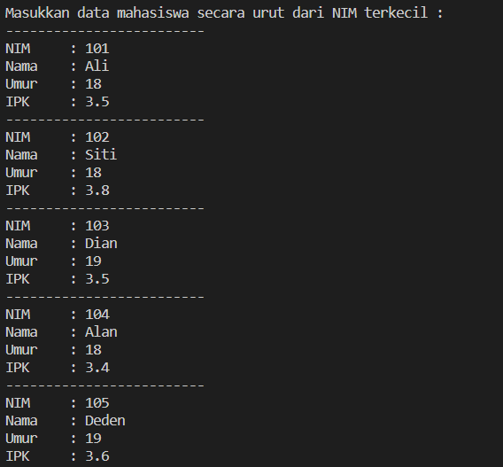

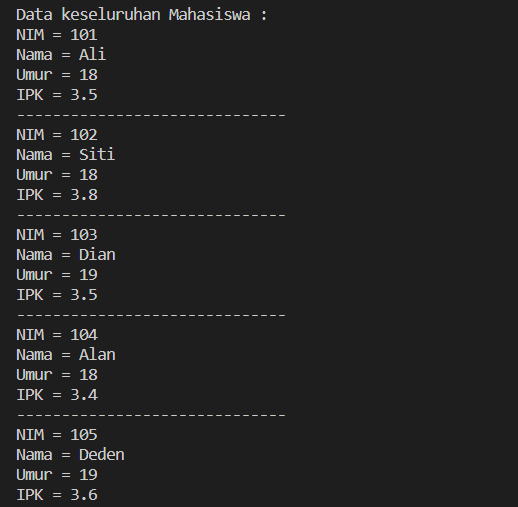

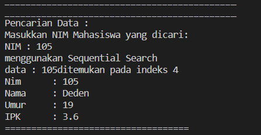

**6.2.3. Pertanyaan**

1. Jelaskan perbedaan metod TampilData dan Tampilposisi pada class PencarianMhs
2. Jelaskan fungsi break pada kode program dibawah ini! 
```
if (listMHs[j].nim==cari){
    posisi = j;
    break;
}
```
3. Jika Data Nim yang dimasukkan tidak terurut dari kecil ke besar. Apakah program masih dapat 
berjalan? Apakah hasil yang dikeluarkan benar? Mengapa demikian!

**Jawab**
1. Tampil data digunakan untuk menampilkan data mahasiswa, Tampil proses digunakan untuk menampilkan posisi index yang dicari
2. Pada array tesebut dengan atribut nim sama dengan data yang di cari. Jika data sama dengan posisi berisi j maka pencarian akan berhenti
3. Masih bisa berjalan. Benar tetapi tidak berurutan molai dari yang terkecil hingga yang terbesar.

**6.3. Searching / Pencarian Menggunakan Binary Search**

**6.3.1. Langkah-langkah Percobaan Binary Search**

**6.3.2. Verifikasi Hasil Percobaan**


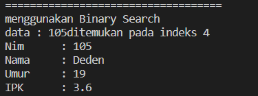

**6.3.3. Pertanyaan**
1. Tunjukkan pada kode program yang mana proses divide dijalankan!
2. Tunjukkan pada kode program yang mana proses conquer dijalankan!
3. Jika data Nim yang dimasukkan tidak urut. Apakah program masih dapat berjalan? Mengapa 
demikian!
4. Jika Nim yang dimasukkan dari NIM terbesar ke terkecil (missal : 20215, 20214, 20212, 
20211, 20210) dan elemen yang dicari adalah 20210. Bagaimana hasil dari binary search? 
Apakah sesuai? Jika tidak sesuai maka ubahlah kode program binary seach agar hasilnya sesuai
5. Modifikasilah program diatas yang mana jumlah mahasiswa yang di inputkan sesuai dengan 
masukan dari keyboard.

**Jawab**
1. 
```
int mid;
    if (right >= left){
        mid = (leaft +right)/2;
}
```
2. 
```
if(cari==listMhs[mid].nim){
        return (mid);
    }else if (listMhs[mid].nim>cari){
    return FindBinarySerch(cari,left,mid-1);
    }else}
    return FindBinarySerch(cari,mid+1,right);
    }
}
```

3. Masih bisa berjalan. Tetapi output program tidak berurutan molai dari yang terkecil hingga yang terbesar, dan inputan yang kita cari tidak ditemukan

4. 
```
public int FindBinarySearch(int cari, int left, int right){
        int mid;
        if(right >= left){
            mid = (left + right) / 2;
            if(cari == listMhs[mid].nim){
                return(mid);
            }else if(listMhs[mid].nim > cari){
                return FindBinarySearch(cari, left, mid - 1);
            }else{
                return FindBinarySearch(cari, mid + 1, right);
            }
        }
        return -1;
    }
}
```

5. 
```
PencarianMhs data = new PencarianMhs();
    System.out.print("Masukkan jumlah Mahasiswa : ");
    int jumMhs = s.nec=xtInt();
    data.jmlMhs(jumMhs);

```

**6.4. Percobaan Pengayaan Divide and Conquer**

**6.4.1. Langkah-langkah Percobaan Merge Sort**

**6.4.2. Verifikasi Hasil Percobaan**

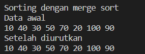

**Latihan**

1. Modifikasi percobaan searching diatas dengan ketentuan berikut ini
- Sebelum dilakukan searching dengan binary search data harus dilakukan pengurutan dengan 
menggunakan algoritma sorting (pilih salah satu algoritma sorting dari pertemuan 
sebelumnya)

**Jawab**

Code
```
public class T1 {
    int nim;
    String nama;
    int umur;
    double ipk;
    
    T1(int ni, String n, int u, double i){
        nim = ni;
        nama = n;
        umur = u;
        ipk = i;
    }

    void tampil(){
        System.out.println("Nim = "+nim);
        System.out.println("Nama = "+nama);
        System.out.println("Umur = "+umur);
        System.out.println("IPK = "+ipk);
    }
}
public class Tu1 {

        T1 listMhs[] = new T1[5];
        int idx;
        
        void tambah(T1 m){
            if(idx < listMhs.length){
                listMhs[idx] = m;
                idx++;
            }else{
                System.out.println("Data sudah penuh !!");
            }
        }
        
        void tampil(){
            for(T1 m : listMhs){
                m.tampil();
                System.out.println("-------------------------------------------");
            }
        }
        
        public int FindSeqSearch(int cari){
            int posisi = -1;
            for(int j=0; j<listMhs.length; j++){
                if(listMhs[j].nim == cari){
                    posisi = j;
                    break;
                }
            }
            return posisi;
        }
    
        public void bubbleSort(){
            for(int i=0; i<listMhs.length-1; i++){
                for(int j=1; j<listMhs.length; j++){
                    if(listMhs[j].nim < listMhs[j-1].nim){
                        T1 temp = listMhs[j];
                        listMhs[j] = listMhs[j-1];
                        listMhs[j-1] = temp;
                    }
                }
            }
        } 
    
        public int FindBinarySearch(int cari, int left, int right){
            int mid;
            if(right >= left){
                mid = (left+right)/2;
                if(cari == listMhs[mid].nim){
                    return (mid);
                }else if(listMhs[mid].nim > cari){
                    return FindBinarySearch(cari, left, mid-1);
                }else{
                    return FindBinarySearch(cari, mid+1, right);
                }
            }
            return -1;
        }
        
        public void TampilPosisi(int x, int pos){
            if(pos != -1){
                System.out.println("data\t : "+ x + " ditemukan pada indeks "+pos);
            }else{
                System.out.println("data\t : "+ x + "tidak ditemukan");
            }
        }
        
        public void TampilData(int x, int pos){
            if(pos != -1){
                System.out.println("Nim\t : "+x);
                System.out.println("Nama\t : "+listMhs[pos].nama);
                System.out.println("Umur\t : "+listMhs[pos].umur);
                System.out.println("IPK\t : "+listMhs[pos].ipk);
            }else{
                System.out.println("data "+x+"tidak ditemukan");
            }
        }
    }
import java.util.Scanner;
public class T1Main {
        public static void main(String[] args) {
            Scanner s = new Scanner(System.in);
            Scanner s1 = new Scanner(System.in);
            
            Tu1 data = new Tu1();
            int jumMhs = 5;
            
            System.out.println("-------------------------------------------");
            System.out.println("Masukkan data mahasiswa secara urut dari Nim Terkecil");
            for(int i=0; i<jumMhs; i++){
                System.out.println("-------------------------------------------");
                System.out.print("Nim\t : ");
                int nim = s.nextInt();
                System.out.print("Nama\t : ");
                String nama = s1.nextLine();
                System.out.print("Umur\t : ");
                int umur = s.nextInt();
                System.out.print("IPK\t : ");
                Double ipk = s.nextDouble();
                
                T1 m = new T1(nim, nama, umur, ipk);
                data.tambah(m);
            }    
                System.out.println("-------------------------------------------");
                System.out.println("Data keseluruhan Mahasiswa sebelum sorting");
                data.tampil();
                
                System.out.println("Data keseluruhan Mahasiswa setelah sorting");
                data.bubbleSort();
                data.tampil();
    
                System.out.println("-------------------------------------------");
                System.out.println("-------------------------------------------");
                System.out.println("Pencarian data : ");
                System.out.println("Masukkan Nim Mahasiswa yang dicari : ");
                System.out.print("NIM : ");
                int cari = s.nextInt();
                System.out.println("menggunakan sequential search : ");
                int posisi = data.FindSeqSearch(cari);
                
                data.TampilPosisi(cari, posisi);
                data.TampilData(cari, posisi);
    
                // Binary Search
                System.out.println("===========================================");
                System.out.println("menggunakan binary search");
                posisi = data.FindBinarySearch(cari, 0, jumMhs-1);
                data.TampilPosisi(cari, posisi);
                data.TampilData(cari, posisi);
            }
    }

```


Output

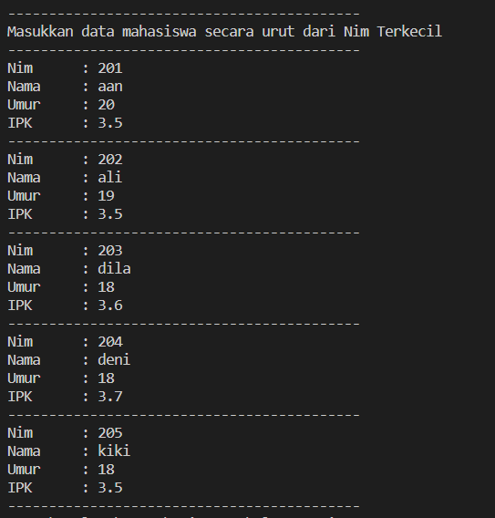

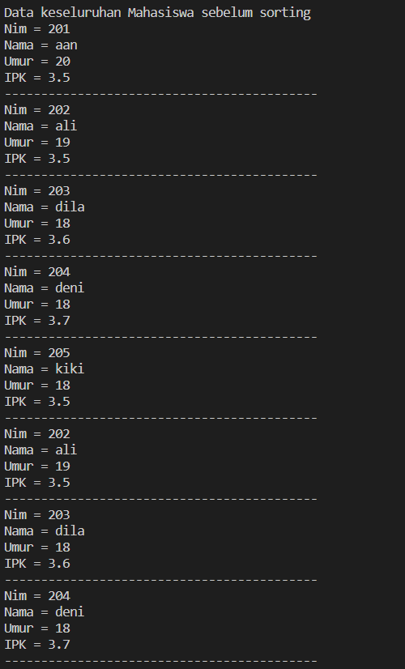

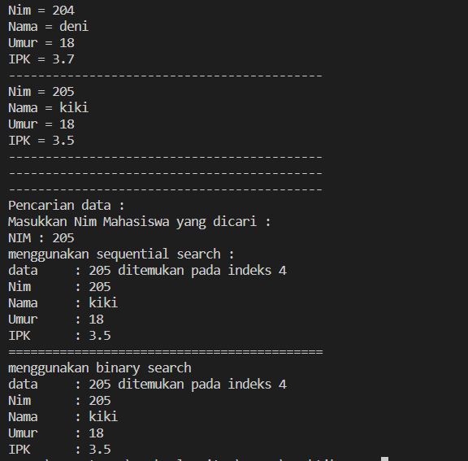


2. Modifikasi percobaan searching diatas dengan ketentuan berikut ini
- Pencarian dilakukan berdasarkan Nama Mahasiswa (gunakan Algoritma Sequential Search)
- Jika terdapat nama yang sama? Bagaimana keluaran dari kode program ketika pencarian dilakukan pada nama yang sama!

**Jawab**

Code
```
public class T1 {
    int nim;
    String nama;
    int umur;
    double ipk;
    
    T1(int ni, String n, int u, double i){
        nim = ni;
        nama = n;
        umur = u;
        ipk = i;
    }

    void tampil(){
        System.out.println("Nim = "+nim);
        System.out.println("Nama = "+nama);
        System.out.println("Umur = "+umur);
        System.out.println("IPK = "+ipk);
    }
}
public class Tu2 {
        T2 listMhs[];
        int idx;
        
        void tambah(T2 m){
            if(idx < listMhs.length){
                listMhs[idx] = m;
                idx++;
            }else{
                System.out.println("Data sudah penuh !!");
            }
        }
        
        void tampil(){
            for(T2 m : listMhs){
                m.tampil();
                System.out.println("-------------------------------------------");
            }
        }
        
        public int FindSeqSearch(int cari){
            int posisi = -1;
            for(int j=0; j<listMhs.length; j++){
                if(listMhs[j].nim == cari){
                    posisi = j;
                    break;
                }
            }
            return posisi;
        }
        
        public int FindSequentialSearch(T2 listMHS[], String cari){
            int posisi = -1;
            for(int i=0; i<listMHS.length; i++){
                if(cari.equalsIgnoreCase(listMHS[i].nama)){
                    posisi = i;
                    TampilPosisi(cari, posisi);
                    TampilData(cari, posisi);
                }
            }
            return posisi;
        }
    
        public void TampilPosisi(String x, int pos){
            if(pos != -1){
                System.out.println("data\t : "+ x + " ditemukan pada indeks "+pos+"\n");
            }else{
                System.out.println("data\t : "+ x + "tidak ditemukan");
            }
        }
        
        public void TampilData(String x, int pos){
            if(pos != -1){
                System.out.println("Nim\t : "+listMhs[pos].nim);
                System.out.println("Nama\t : "+x);
                System.out.println("Umur\t : "+listMhs[pos].umur);
                System.out.println("IPK\t : "+listMhs[pos].ipk);
            }else{
                System.out.println("data "+x+"tidak ditemukan");
            }
        }
    }
 import java.util.Scanner;

public class T2Main {

        public static void main(String[] args) {
            Scanner s = new Scanner(System.in);
            Scanner s1 = new Scanner(System.in);
            
            Tu2 data = new Tu2();
            System.out.print("Masukkan jumlah Mahasiswa: ");
            int jumMhs = s.nextInt();
            T2[] mhs = new T2[jumMhs];
            data.listMhs = mhs;
    
            System.out.println("-------------------------------------------");
            System.out.println("Masukkan data mahasiswa secara urut dari Nim Terkecil");
            for(int i=0; i<jumMhs; i++){
                System.out.println("-------------------------------------------");
                System.out.print("Nim\t : ");
                int nim = s.nextInt();
                System.out.print("Nama\t : ");
                String nama = s1.nextLine();
                System.out.print("Umur\t : ");
                int umur = s.nextInt();
                System.out.print("IPK\t : ");
                double ipk = s.nextDouble();
                
                T2 m = new T2(nim, nama, umur, ipk);
                data.tambah(m);
            }    
                System.out.println("-------------------------------------------");
                System.out.println("Data keseluruhan Mahasiswa : ");
                data.tampil();
    
                System.out.println("-------------------------------------------");
                System.out.println("-------------------------------------------");
                System.out.println("Pencarian data : ");
                System.out.println("Masukkan Nama Mahasiswa yang dicari : ");
                System.out.print("Nama : ");
                String cari = s1.nextLine();
                System.out.println("\n\nMenggunakan sequential search ");
                data.FindSequentialSearch(data.listMhs, cari);
            }
    }

```   


Output

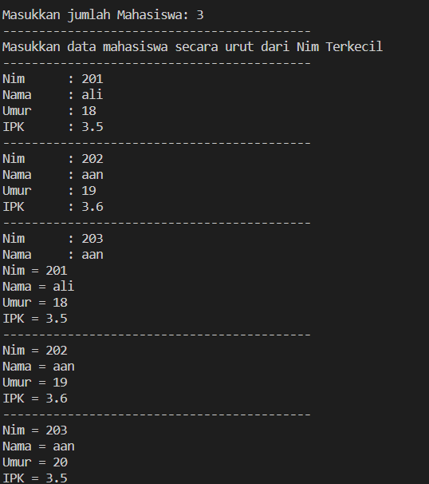

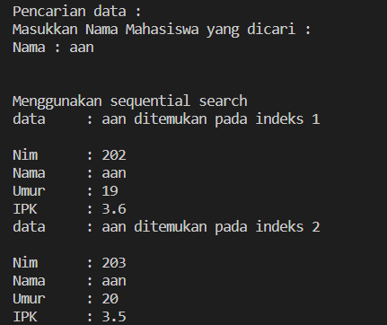


3. Terdapat sebuah data array 1 dimensi sebagai berikut 

    Buatlah program untuk mengurutkan array tersebut (boleh memilih metode pengurutan) selanjutnya lakukan pencarian dan mencetak isi array yang nilainya terbesar, dan mencetak ada berapa buah nilai terbesar tersebut serta berada dilokasi mana saja nilai terbesar tersebut! (menggunakan binary search)

 **Jawab**

Code
```
public class T3 {
    public int[] data;
    public int maks = 0;
    public int posisi;
    public int jml = 0;

    T3(int nilai[]){
        data = nilai;
    }

    void tampil(){
        for(int i=0; i<data.length; i++){
            System.out.println(data[i] + " ");
            System.out.println();
        }
    }

    void bubbleSort(){
        for(int i=0; i<data.length-1; i++){
            for(int j=1; j<data.length; j++){
                if(data[j]> data[j-1]){
                    int temp = data[j];
                    data[j] = data[j-1];
                    data[j-1] = temp;
                }
            }
        }
    }

    public int binarySearch(int cari, int left, int right){
        int middle;
        if(right >= left){
            middle = (left+right)/2;
            if(cari == data[middle]){
                return (middle);
            }else if(data[middle] > cari){
                return binarySearch(cari, middle+1, right);
            }else{
                return binarySearch(cari, left, middle-1);
            }
        }
        return -1;
    }

    public int nilaiTerbesar(){
        for(int i=0; i<data.length; i++){
            if(data[i] > maks){
                maks = data[i];
            }
        }
        System.out.println("Nilai yang paling besar adalah : "+maks);
        return maks;
    }

    public void tampilPosisi(int pos){
        for(int i=0; i<data.length; i++){
            if(data[i] == maks){
                jml++;
            }
        }
        System.out.print("dengan jumlah "+ jml);
        System.out.println();
        posisi = maks;

        for(int i=0; i<data.length; i++){
            if(posisi == data[i]){
                pos = i;
                System.out.println("Data ditemukan pada indeks ke-"+pos);
            }
        }
    }
}
public class T3Main {
    public static void main(String[] args) {
        int angka[] = {12, 17, 2, 1, 70, 50, 90, 17, 2, 90};

        T3 arr = new T3(angka);

        int sum = 10, maks=0;
        System.out.println("=========================================");
        System.out.println("                TAMPILAN DATA            ");
        System.out.println("=========================================");
        System.out.println("Sebelum di sorting");
        arr.tampil();
        arr.bubbleSort();
        System.out.println("=========================================");
        System.out.println("Setelah di sorting");
        arr.tampil();
        arr.nilaiTerbesar();
        arr.binarySearch(maks, 0, sum-1);
        arr.tampilPosisi(maks);
    }
}
```

Output
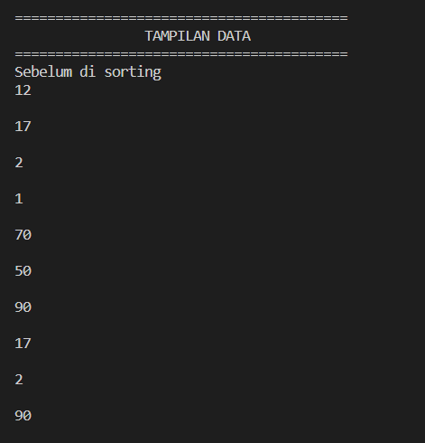

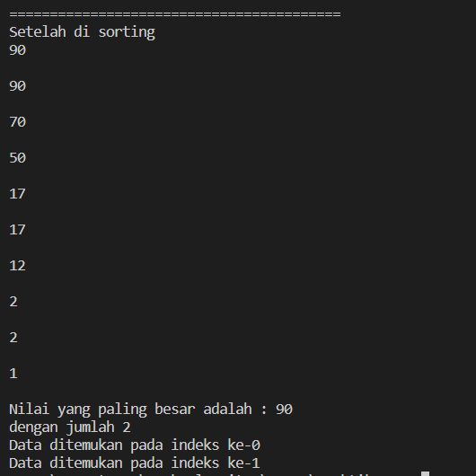
